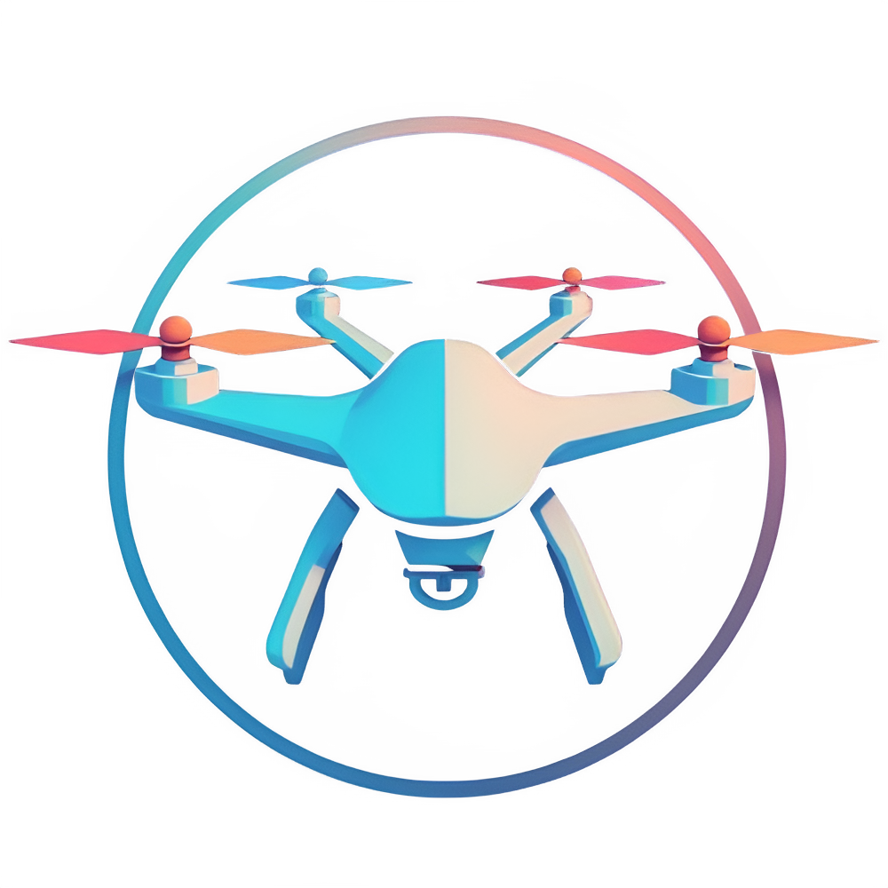

<div align="center">
    <a href="https://github.com/mosait/Drone_Data_Analyzer" />
        
    </a>
</div>

# Drone Analytics

Compare and analyze drone data with ease.

## Architecture

- Framework: React (v18.3.1)
- Build Tool: Vite (v6.0.7)
- Variant: TypeScript (v5.6.3)
- Backend: FastAPI (v0.115.6 with Python v3.12.6)

## Run Application

#### Docker (Recommended)

Using Docker, run the following command in the root directory of the project:

```
docker-compose -f ./docker/docker-compose.yml up --build
```

This will build the Docker image and start the containers for the frontend and backend services.
The backend runs on `http://localhost:8000/`.
Than navigate to `http://localhost:3000` to access the application.

#### No Docker

If you want to run the application without Docker, you need two terminals.

In the first terminal, run the following commands to start the backend server:

```
cd ./backend
python -m venv venv

Windows  : .\venv\Scripts\activate
Linux/Mac: source ./venv/bin/activate

pip install -r requirements.txt
python ./run_backend
```

In the second terminal, run the following commands to start the frontend server:

```
cd ./frontend
npm install
npm run dev
```

The backend runs on `http://localhost:8000/`.
Then navigate to `http://localhost:5173/` to access the application.

## Data Formats

Currently the application only supports imports and exports as

- CSV
- JSON

When importing data the files will be saved in `/uploads/` and can be used afterwards via Recent Files without the need of a second import.
The folder `/uploads/` as well as the file `/uploads/file_mapping.json` will be created automatically if they do not exist.

#### CSV Structure

```
timestamp,latitude,longitude,altitude,radar_distance
10:00:00,48.7758,9.1829,100,80
10:01:00,48.7760,9.1832,120,85
10:02:00,48.7763,9.1835,150,90
...
```

#### JSON Structure

```
[
  {
    "timestamp": "10:00:00",
    "gps": {
      "latitude": 48.7758,
      "longitude": 9.1829,
      "altitude": 100
    },
    "radar": {
      "distance": 80
    }
  },
  ...
]
```
